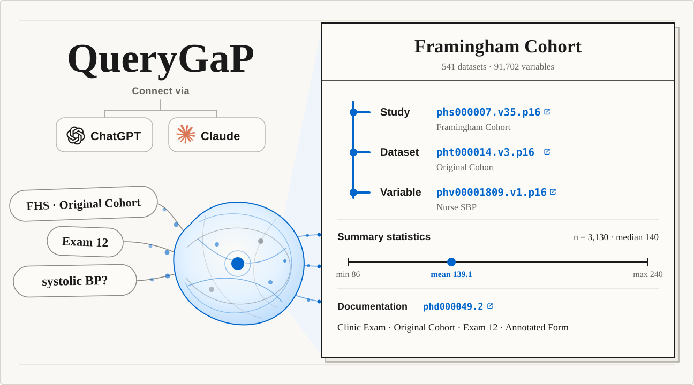

# QueryGaP MCP



## Use QueryGaP with ChatGPT and Claude directly in your browser

**No local installation. No QueryGaP account. No QueryGaP API key.**

[](https://github.com/will-marella/querygap-mcp/actions/workflows/ci.yml)

QueryGaP gives your assistant structured access to dbGaP and UK Biobank
documentation metadata. Use it to resolve dbGaP studies, find variables,
datasets, and document metadata within an exact study accession, and search or
inspect UK Biobank fields—with source identifiers and canonical links in the
results.

The MCP client supplies the reasoning and decides which tools to call. QueryGaP
handles study resolution, scoped retrieval, ranking, and provenance.

## Connect

QueryGaP is a hosted remote MCP server. Use this URL in any compatible client:

```text
https://mcp.querygap.org/mcp
```

The hosted public beta requires no QueryGaP account, access token, or
user-supplied OpenAI key.

### Use QueryGaP in a browser

**Claude**

1. In Claude on the web, open `Customize > Connectors`.
2. Select `+`, then `Add custom connector`.
3. Enter `QueryGaP` and `https://mcp.querygap.org/mcp`, leaving the optional
   authentication fields blank.
4. In a conversation, select `+ > Connectors` and enable QueryGaP.

The same remote connector is also available in Claude Desktop. See
[Anthropic's custom connector guide](https://support.claude.com/en/articles/11175166-get-started-with-custom-connectors-using-remote-mcp).
On managed Team and Enterprise accounts, an organization owner must add the
connector before members can enable it.

**ChatGPT**

Where ChatGPT Developer mode is available:

1. Open `Settings > Security and login` and enable `Developer mode`.
2. Open `ChatGPT Plugins`, select `+`, and create a developer-mode app.
3. Use `https://mcp.querygap.org/mcp` as the remote MCP URL and select no
   authentication.
4. Enable the app from the conversation's Developer mode tools.

See the [ChatGPT Developer mode guide](https://developers.openai.com/api/docs/guides/developer-mode).

### Use QueryGaP with a coding agent

**Codex**

```bash
codex mcp add querygap --url https://mcp.querygap.org/mcp
```

**Claude Code**

```bash
claude mcp add --transport http --scope user querygap https://mcp.querygap.org/mcp
```

The user scope makes QueryGaP available across projects. See the
[Claude Code MCP guide](https://code.claude.com/docs/en/mcp).

For another MCP client, add the endpoint as a remote Streamable HTTP server
with no authentication.

### Try it

**dbGaP**

> Resolve the Framingham Heart Study, then find variables related to systolic
> blood pressure. Return their exact dbGaP IDs, descriptions, parent datasets,
> and source links.

**UK Biobank**

> Find UK Biobank fields related to kidney function. Inspect the most relevant
> field and return its exact field ID, title, category path, available instance
> summaries, and source link.

## Tools

| Tool | Purpose |
| --- | --- |
| `resolve_dbgap_study` | Resolve a study name, acronym, accession, or dbGaP URL to ranked candidates. |
| `get_dbgap_study` | Retrieve metadata for an exact versioned dbGaP accession. |
| `search_dbgap_catalog` | Search a resolved study's variables, datasets, or document-title metadata using keyword, semantic, or hybrid retrieval. |
| `search_ukb_fields` | Search the UK Biobank field dictionary by concept, field ID, or stored aliases. |
| `get_ukb_field` | Retrieve an exact UK Biobank field and optional instance summaries. |

For dbGaP, QueryGaP resolves the study first and preserves the full versioned
accession throughout retrieval. UK Biobank remains a separate, field-centric
source.

## Scope

QueryGaP searches public documentation metadata, not participant-level records.
The hosted MCP is read-only and uses a catalog-only database separate from
QueryGaP accounts, chats, credits, and billing data. Keyword search does not
call a model provider; semantic and hybrid search use QueryGaP-funded query
embeddings.

This repository contains the MCP runtime, retrieval implementation, ontology,
tests, evaluation material, and security controls. It connects to the hosted
QueryGaP catalog; the catalog snapshot and ingestion pipeline are separate.

## Development

QueryGaP MCP supports Python 3.10 and newer. Unit tests use fakes, so they
require neither a catalog database nor OpenAI access.

```bash
python -m venv .venv-mcp
.venv-mcp/bin/pip install -r requirements-mcp-dev.txt
.venv-mcp/bin/python -m pytest -q tests/mcp
```

Running a server against a real catalog requires a schema-compatible PostgreSQL
database and the dedicated read-only role described in
[`ops/querygap_mcp_ro.sql`](ops/querygap_mcp_ro.sql).

## Documentation

- [`docs/mcp.md`](docs/mcp.md): local setup and complete tool contract
- [`querygap://ontology/v0`](querygap_mcp/resources/ontology-v0.md): entities,
  identity, relationships, and provenance
- [`querygap://retrieval-contract/v0`](querygap_mcp/resources/retrieval-contract-v0.md):
  study scoping and retrieval rules
- [`docs/mcp-security.md`](docs/mcp-security.md): hosted security boundary
- [`docs/mcp-evaluation.md`](docs/mcp-evaluation.md): evaluation protocol

## Status and license

The hosted endpoint is live as a best-effort public beta with deliberate usage
limits. QueryGaP MCP is licensed under the Apache License 2.0; see
[`LICENSE`](LICENSE). Use GitHub Issues for questions and follow
[`SECURITY.md`](SECURITY.md) for vulnerability reports.
