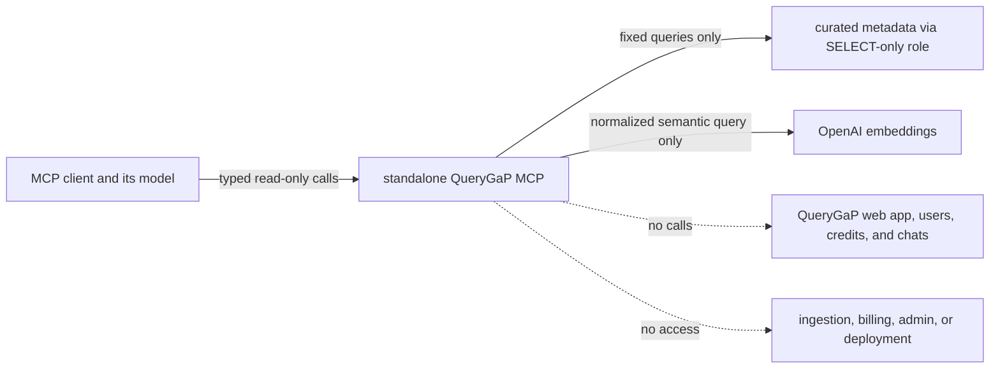

# QueryGaP MCP security boundary

This document describes both the validated local prototype and the isolated
anonymous Railway beta. The beta is suitable for bounded testing, not yet for
marketplace submission or broad promotion.

## Implemented in both runtimes

- Five fixed base tools and two configurable All of Us public-metadata tools;
  the hosted beta currently exposes all seven. Neither configuration exposes
  arbitrary SQL, URL fetching, ingestion, writes, participant data, chat,
  billing, user records, or deployment operations.
- A mandatory `QG_MCP_DATABASE_URL`, separate connection pool, read-only
  transactions, pinned `pg_catalog, public` search path, and bounded statement
  and lock timeouts. The repository `.env` and web app `DATABASE_URL` are never
  loaded by the MCP package.
- Optional AoU tables remain in the same dedicated catalog database under an
  explicit `aou` schema. `QG_MCP_AOU_ENABLED=1` adds exact schema, relation,
  index, active-snapshot, and embedding-cache preflight checks.
- Full versioned dbGaP study scoping and a maximum of 20 results per search.
- Normalized query limits, a 64 KiB HTTP body limit, a 128 KiB structured-result
  limit, bounded text fields, and canonical URL allowlists.
- Sanitized stable error codes without database/provider exception text.
- Embedding-provider timeout, disabled automatic retries, bounded per-process
  cache, and `QG_MCP_EMBEDDINGS_ENABLED=0` kill switch.
- No PostHog or Agenta integration and no application-level logging of queries
  or returned metadata.

Retrieved scientific text remains untrusted. The server returns data rather
than HTML and never executes or fetches links found in results, but the client
model must still ignore instruction-like content embedded in source metadata.

## Implemented in the hosted beta

- A separate Railway project, service, PostgreSQL database, and persistent
  budget volume; the existing QueryGaP web deployment is unchanged.
- A `NOINHERIT`, `SELECT`-only, connection-limited database role whose startup
  audit has zero warnings and whose deployed allowlist contains only eight base
  catalog relations and fourteen AoU relations.
- Exact Host/Origin allowlists, HTTPS, public liveness/readiness, explicit
  anonymous mode enabled after bearer-gated validation, and no `/mcp/`
  redirect ambiguity.
- A 64 KiB body cap, four-request concurrency cap, persistent global
  minute/day request caps, persistent daily embedding cap, provider timeout,
  and keyword fallback for hybrid runtime failures.
- Privacy-safe application logs with fixed method/route labels and no access
  logs, query text, result content, headers, client identifiers, or exception
  details.

## Required before broad promotion

- Preserve the dedicated PostgreSQL identity. Grant `SELECT` only on the
  required curated public views/tables; deny chat, user, credit, billing,
  ingestion, and administrative schemas. The application's read-only session
  guard is defense in depth, not a replacement for database privileges.
  `ops/querygap_mcp_ro.sql` is the idempotent role policy and
  `ops/querygap_mcp_ro_audit.sql` reports only PASS/WARN/FAIL remediation
  summaries.
  Create LOGIN and assign its generated password separately through a
  parameterized administration helper; neither SQL file contains credentials.
  Any `FAIL` is blocking. `WARN` is accepted only for bounded local testing;
  public hosting requires resolving or isolating the inherited capability. In
  particular, role-specific REVOKE cannot negate access supplied by `PUBLIC`,
  table ownership, or a role membership.
- Decide whether the current persistent global caps are sufficient for the
  intended beta audience or add edge/distributed controls. Source IP is only
  coarse surge protection because hosted MCP clients can share egress addresses.
- Keep proxy and application logs free of raw request bodies, queries, results,
  IP addresses, credentials, and exception text. Log only request ID, tool,
  duration, result count, and stable error code.
- Materialize or cache study counts before treating study resolution as
  abuse-resistant; the current repository query aggregates catalog tables.
- Confirm redistribution/public-display permission for every exposed data
  class, particularly UK Biobank-derived metadata and participant summaries.
- Publish privacy/support/terms pages, and add standard authorization only if
  anonymous cost/abuse cannot be kept within a deliberate budget.
- Run database privilege tests, saturation/cancellation tests, MCP Inspector,
  and a live canary from each intended client. Unit and local transport tests do
  not establish hosted interoperability.

## Explicitly out of scope

The MCP surface does not hold user API keys. QueryGaP funds only query
embeddings; the MCP client is responsible for its own reasoning-model usage.
The current QueryGaP Railway application is not modified or coupled to this
service.
